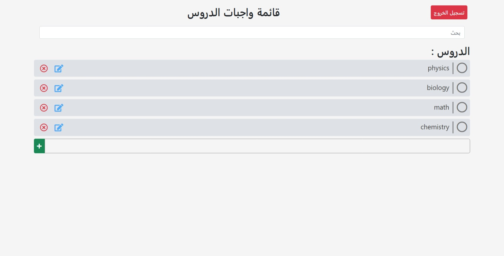

# To-Do List Project

## Project Overview

This is a web-based To-Do List application built with **PHP**, **MySQL**, and **Composer**. It follows an MVC architecture and uses modern dependency management.

## Screenshot



## Prerequisites

To run this project, you need:

- **PHP** (Version 7.4 or higher)
- **Composer**
- **MySQL** or **MariaDB**
- **Apache** (or Nginx)

## Installation Guide

### 1. Setup Files

Clone the repository or copy the project files to your web server's root directory (e.g., `htdocs` or `www`).

### 2. Install Dependencies

Run the following command in the project root to install required PHP libraries:

```bash
composer install
```

### 3. Database Setup

1. Create a new database (e.g., `todo_list_db`).
2. Import the SQL file located at `data_base-file/todo-list.sql`.

## How to Run

### 4. Configuration

1. copy `.example.env` and paste it in the root directory as name `.env`
2. Configure your database connection details in the `.env` file:
   ```env
   DB_HOST=localhost
   DB_NAME=todo_list_db
   DB_USER=root
   DB_PASS=
   ```

### 5. Running the App

1. Start your web server (Apache/MySQL).
2. Navigate to the project URL (e.g., `http://localhost/todo-list`).
3. To login, navigate to `/login` (e.g., `http://localhost/todo-list/login`).
